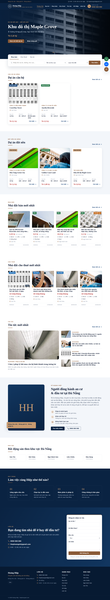

# Website WordPress – hiephoangmt.com

Website thương hiệu cá nhân **Hoàng Hiệp – bất động sản Đà Nẵng**. Tông màu navy và trắng, điểm nhấn màu nâu.



## Có gì trong website

| Phần | Mô tả |
|------|-------|
| **Trang chủ** | Banner tự chạy slide các dự án nổi bật, ô tìm kiếm (Mua bán / Cho thuê / Dự án), **Dự án căn hộ**, **Dự án đất nền**, **Nhà đất bán**, **Nhà đất cho thuê**, **Tin tức mới nhất**, giới thiệu Hiệp, khu vực Đà Nẵng, quy trình làm việc, form nhận tư vấn |
| **Dự án** (`/du-an/`, `/loai-du-an/can-ho/`, `/loai-du-an/dat-nen/`) | Lọc theo loại, tình trạng, khu vực. Trang chi tiết có mục lục dính khi cuộn: Tổng quan · Vị trí · Tiện ích · Mặt bằng · Giá & thanh toán · Tiến độ · Hình ảnh · Hỏi đáp, form "Nhận bảng giá" |
| **Mua bán / Cho thuê** (`/mua-ban/`, `/cho-thue/`) | Lọc theo khu vực, loại, mức giá, diện tích, phòng ngủ, hướng; sắp xếp theo giá, diện tích. Trang chi tiết có album ảnh phóng to, bảng thông số, đơn giá/m², điều kiện thuê, video, bản đồ, form "Đặt lịch xem nhà" |
| **Về Hiệp** (`/gioi-thieu/`) | Hồ sơ cá nhân: ảnh, slogan, giới thiệu, số liệu, dịch vụ |
| **Khách hàng** (trong quản trị) | Mỗi lần khách gửi form, website lưu lại khách kèm căn/dự án họ quan tâm và gửi email báo cho bạn. Trạng thái: Mới → Đã liên hệ → Đang chăm sóc → Đã chốt |
| **Điện thoại** | Thanh dưới cùng: Gọi ngay · Chat Zalo · Nhận tư vấn |

### Nhập liệu: chỉ việc điền chữ

Khi thêm **Dự án** hoặc **Nhà đất**, bên dưới khung soạn thảo có hộp nhập liệu chia thành nhiều tab. Mỗi ô đều có ví dụ mẫu. **Ô nào để trống thì website tự ẩn.**

- **Dự án**: Tổng quan (chủ đầu tư, quy mô, mật độ, số tòa, pháp lý, bàn giao, điểm nổi bật…) · Vị trí (mô tả, kết nối vùng, bản đồ) · Tiện ích nội/ngoại khu · Mặt bằng & loại sản phẩm · Bảng giá, tiến độ thanh toán, chính sách, hỗ trợ vay, link brochure · Tiến độ xây dựng · Thư viện ảnh, video YouTube · Hỏi đáp.
- **Nhà đất**: Bán/Cho thuê, tình trạng, giá (nhập số triệu, website tự hiện "3,2 tỷ" và tính đơn giá/m²) · Diện tích, kích thước, mặt tiền, hẻm, hướng, số tầng, phòng ngủ, WC, nội thất, pháp lý · Điều kiện thuê · Đặc điểm nổi bật, tiện ích xung quanh · Ảnh, video, bản đồ. Mỗi tin tự có mã (VD: HH00020).
- Bảng (bảng giá, kết nối, tiến độ…): mỗi dòng một hàng, các cột cách nhau bằng dấu `|`, ví dụ `Căn 2PN | 68 m² | 3,35 tỷ | View sông`.

### SEO Google & ChatGPT

- Tiêu đề và mô tả tự sinh cho từng trang, có từ khóa "Đà Nẵng" (VD: "Nhà đất bán Đà Nẵng", "Dự án đất nền Đà Nẵng"). Phần **Tóm tắt** của bài/dự án được dùng làm mô tả trên Google.
- Thẻ Open Graph để chia sẻ Facebook/Zalo có ảnh và mô tả.
- Dữ liệu cấu trúc schema.org: `RealEstateAgent` (Hiệp), `ApartmentComplex`/`Product` + `FAQPage` (dự án), `RealEstateListing` (tin nhà đất), `BlogPosting` (tin tức), `BreadcrumbList`, `ItemList`.
- Sitemap tự động: `/wp-sitemap.xml`. File `robots.txt` cho phép Google, Bing và các bot AI (GPTBot, OAI-SearchBot, ChatGPT-User, PerplexityBot, ClaudeBot, Google-Extended…).
- **`/llms.txt`**: bản tóm tắt toàn bộ website (giới thiệu, liên hệ, danh sách dự án, nhà đất, tin tức) giúp ChatGPT và các AI đọc và trích dẫn chính xác.
- Trang lọc/sắp xếp gắn `noindex` để tránh trùng nội dung. Ảnh thiếu chữ thay thế (alt) sẽ tự lấy tên bài. Có ngày "Cập nhật" trên dự án và tin đăng.
- Nếu sau này cài Yoast SEO / Rank Math, phần SEO của theme tự tắt để không bị trùng.

Sau khi website chạy thật, nên khai báo `https://hiephoangmt.com/wp-sitemap.xml` trong Google Search Console và Bing Webmaster Tools (Bing cung cấp dữ liệu tìm kiếm cho ChatGPT).

## Đưa lên tên miền hiephoangmt.com

### 1. Chuẩn bị máy chủ
Thuê một VPS Linux (Ubuntu 22.04+, từ 1 GB RAM), cài Docker:
```bash
curl -fsSL https://get.docker.com | sh
```

### 2. Trỏ tên miền
Tại nơi quản lý DNS của `hiephoangmt.com`, tạo bản ghi:

| Loại | Tên | Giá trị |
|------|-----|---------|
| A | `@` | IP của VPS |
| A | `www` | IP của VPS |

### 3. Cài đặt
```bash
git clone <repo này> && cd hoang-hiep-crm/wordpress
cp .env.example .env
nano .env                      # đổi toàn bộ mật khẩu
docker compose --profile production up -d
./scripts/setup.sh             # cài WordPress, theme, trang, menu, khu vực Đà Nẵng, loại dự án
```
Mở https://hiephoangmt.com/wp-admin và đăng nhập bằng `WP_ADMIN_USER` / `WP_ADMIN_PASSWORD`.

### 4. Sau khi cài
1. **Giao diện → Tùy biến → Hoàng Hiệp – Thương hiệu**:
   - *Thông tin cá nhân*: họ tên, chức danh, slogan, giới thiệu, **ảnh chân dung**.
   - *Số liệu nổi bật*: năm kinh nghiệm, số giao dịch… (để trống thì ẩn).
   - *Liên hệ & mạng xã hội*: hotline, Zalo, email, Facebook, YouTube, TikTok.
   - *Banner trang chủ*: tiêu đề, mô tả, ảnh nền (dùng khi chưa có dự án nổi bật).
2. **Dự án → Thêm dự án**: nhập thông tin, đặt **ảnh đại diện** (ảnh banner), chọn **Loại dự án** (Căn hộ / Đất nền…) và **Khu vực**, tick "Dự án nổi bật" để lên slide trang chủ.
3. **Nhà đất → Đăng tin**: chọn Bán/Cho thuê, nhập giá, diện tích…, chọn Loại nhà đất và Khu vực.
4. **Bài viết → Viết bài mới** cho mục Tin tức (nhớ điền phần Tóm tắt và ảnh đại diện).
5. Nên cài thêm plugin gửi mail SMTP (VD: *WP Mail SMTP*) để email báo khách mới không vào thư rác, và một plugin sao lưu.

## Chạy thử trên máy
Trong `.env` đặt `SITE_URL=http://localhost:8080`, rồi:
```bash
docker compose up -d
./scripts/setup.sh
```
Truy cập http://localhost:8080 (không cần Caddy).

## Cấu trúc
```
wordpress/
├── docker-compose.yml          # db, wordpress, wpcli (tools), caddy (production, HTTPS tự động)
├── Caddyfile                   # HTTPS + chuyển www → không www
├── .env.example
├── uploads.ini                 # giới hạn upload 64 MB
├── scripts/setup.sh            # cài đặt lần đầu bằng WP-CLI
└── wp-content/
    ├── mu-plugins/
    │   ├── hh-crm.php          # nạp plugin
    │   └── hh-crm/
    │       ├── schemas.php     # danh sách ô nhập liệu Dự án / Nhà đất (thêm bớt ô tại đây)
    │       ├── fields.php      # hộp nhập liệu dạng tab, chọn ảnh
    │       ├── types.php       # loại nội dung, đường dẫn /mua-ban/ /cho-thue/, bộ lọc
    │       └── leads.php       # form & quản lý khách hàng
    └── themes/hoanghiep/       # giao diện + inc/seo.php (SEO Google & AI)
```

Theme và plugin cũng dùng được trên hosting WordPress thông thường (cPanel…): tải thư mục `themes/hoanghiep` vào `wp-content/themes/`, toàn bộ thư mục `mu-plugins` vào `wp-content/mu-plugins/`, rồi kích hoạt theme *Hoàng Hiệp* và vào **Cài đặt → Đường dẫn tĩnh → Lưu** một lần.
